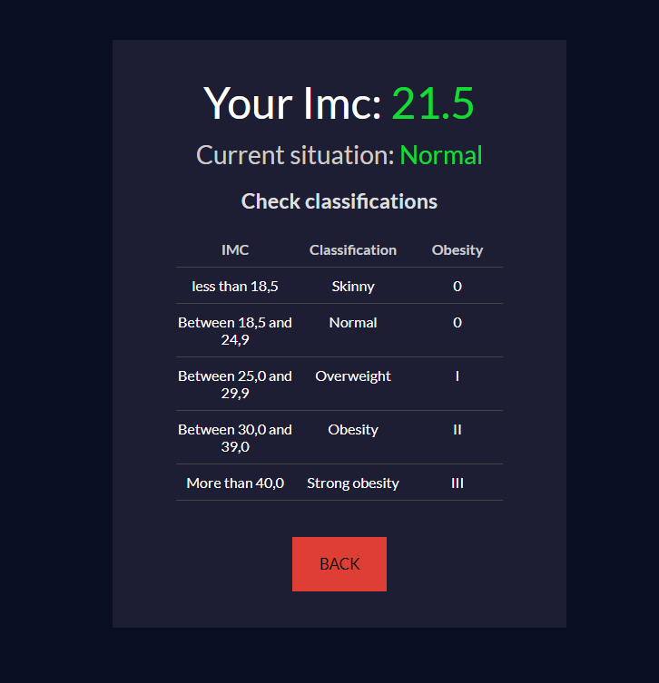
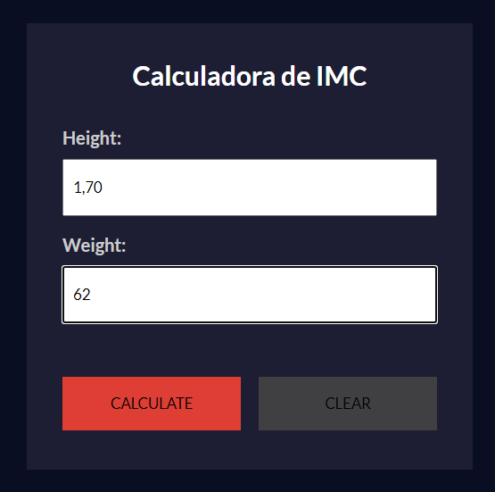

# (Title)

This is a [Project name](project link). 

## Table of contents

- [Overview](#overview)
  - [The purpose](#The-purpose)
  - [Screenshot](#screenshot)
- [My process](#my-process)
  - [Built with](#built-with)
  - [What I learned](#what-i-learned)
- [Author](#author)

## Overview

### The-purpose

Users should be able to:

- Fill in the form with your measurements
- Calculate your BMI value

### Screenshot

## My process

### Built with

- Semantic HTML5 markup
- CSS custom properties
- Componentization of elements 
- [React](https://reactjs.org/) - JS library
- Javascript

### What I learned

componentization of elements

## Author

- Website - [Leandro](https://leandro-pixel.github.io/React-Portfolio/)
- Linkdin - [@Leandro-Soares-Neves](https://www.linkedin.com/in/leandro-soares-neves/)

